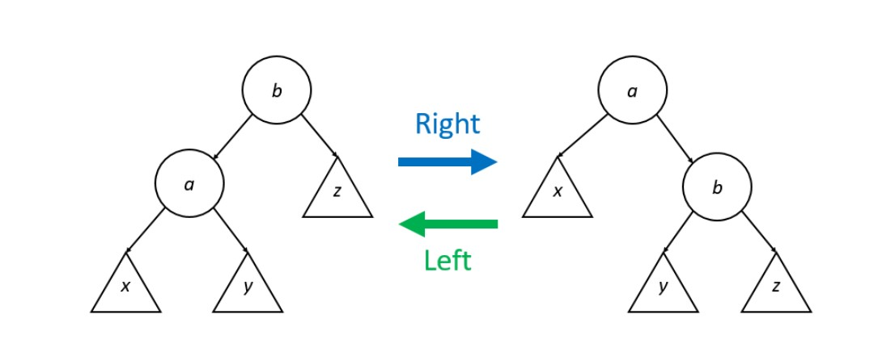

# Week3 Note
## Priority Queue
### Properties
* **"Highest Priority In, First Out" (HPIFO)**
* **insert(element):** Add element to the Priority Queue
* **peek():** Look at the highest priority element in the Priority Queue
* **pop():** Remove the highest priority element from the Priority Queue
### Run time of different Implementation
* **Sorted Linked List:** O(1) in peeking and removing. O(n) find and insertion.
* **Unsorted Linked List** O(1) in insertion. O(n) peeking and removing.
* **Sorted Array** O(1) in peeking and removing. O(n) find and insertion.
* **Unsorted Array** O(1) in insertion. O(n) peeking and removing.
### Heap Implementation
* **Heap Property:** Tree satisfies the Heap Property: For all nodes A and B, if node A is the parent of node B, then node A has higher priority (or equal priority) than node B.
* **Shape Property:** A heap is a complete tree. All levels of the tree, except possibly the bottom one, are fully filled, and, if the last level of the tree is not complete, the nodes of that level are filled from left to right
### Run time of Heap implementation
* We have direct access to the root element, the **peek operation is O(1)** in the worst case.
* Insertion: 1. Insert new node into any empty slot. 2. Bubble up until balaenced. Since we jave O(log n) levels in our tree. **Insertion is O(logn).**
* Removal: 1. Swap root with last node. 2. Trickle down to balaence the tree. The overall **pop algorithm is O(log n).**
### Implementing heap use Array
* Given index i of array to find parent and children.
* its parent is at index $i-1 \over 2$
* its left child is at index $2i + 1$
* its right child is at index $ 2i + 2$
## Randomized Search Tree(RST)
### Properties
* A Treap(Tree + Heap) is a binary tree in which nodes contain two items, a **key** and a **priority**
* The tree must follow the **Binary Search Tree** properties with respect to its **keys**.
* The tree must follow the **Heap Property with** respect to its **priorities**.
* Given a set of (key, priority) pairs, insert the (key, priority) pairs in decreasing order of priority, using the regular **Binary Search Tree** insertion algorithm with respect to the keys. The resulting BST is a Treap.
### Methods
* Find: Identical to find in BST
* Insert: 1. Regular BST insertion. 2. **AVL Rotation.**
### AVL Rotation
* Right and Left directions

```
AVLRight(b): // Perform a right AVL rotation on node b
    a = left child of b
    y = right child of a (or NULL if a does not have a right child)
    p = parent of b (or NULL if b does not have a parent)
    if p is not NULL and b is the right child of p:
        make a the right child of p
    otherwise, if p is not NULL and b is the left child of p:
        make a the left child of p
    make y the left child of b
    make b the right child of a

AVLLeft(a): // Perform a left AVL rotation on node a
    b = right child of a
    y = left child of b (or NULL if b does not have a left child)
    p = parent of a (or NULL if a does not have a parent)
    if p is not NULL and a is the right child of p:
        make b the right child of p
    otherwise, if p is not NULL and a is the left child of p:
        make b the left child of p
    make y the right child of a
    make a the left child of b
```
### Randomized Search Tree
* Supply the key. The priority is randomly generated.
* Treap properties.
* **O(logn)** average-case time complexity. Worst **O(n)** time complexcity.
### Visualization
- [RST](https://www.cs.usfca.edu/~galles/visualization/Heap.html)
## AVL Trees
### Properties
- BST properties
- The **balance factor** of a node u is equal to the height of u's right subtree minus the height of u's left subtree
- A Binary Search Tree is an **AVL Tree** if, for all nodes u in the tree, the balance factor of u is either **-1, 0, or 1**
- **AVL Tree** containing n nodes has a height that is indeed O(log n).
- AVL Tree has a **worst-case** time complexity of **O(log n)**.
### Methods
- Insertion
    1. Regular BST insertion
    2. starting at the newly-inserted node, traverse up the tree and update the balancE factor of each of the new node's ancestors.
    3. For any nodes that are now "out of balance" (i.e., their balance factor is now less than -1 or greater than 1), perform **AVL rotations** to fix the balance.
### Double Rotation
* A series of two AVL rotations
    1. Perform AVL rotation to transform kink into a stright line
    2. Perform another AVL rotation to balaence the tree.
### Visualization
- [AVLTree](https://www.cs.usfca.edu/~galles/visualization/AVLtree.html)
## Red-Black Trees
